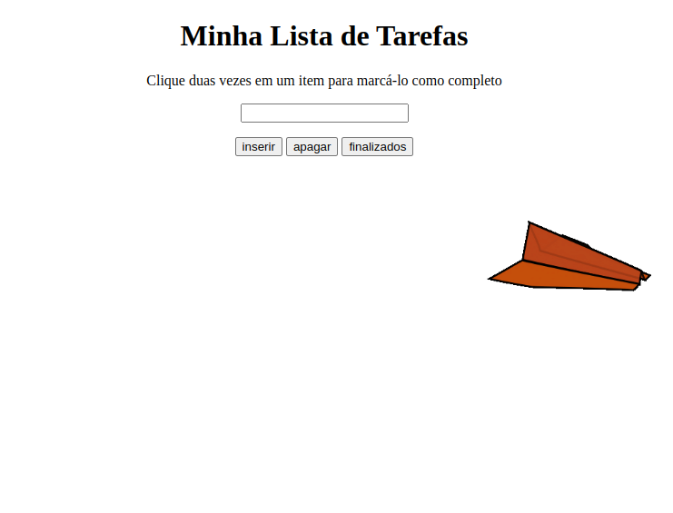

# Boas vindas ao repositório do projeto To-Do List!🚀🚀

# Sumário

- [Boas vindas ao repositório do projeto To-Do List!🚀🚀](#boas-vindas-ao-repositório-do-projeto-to-do-list)
- [Sumário](#sumário)
- [Sobre:](#sobre)
  - [Imagem do projeto:](#imagem-do-projeto)
- [Tecnologias:](#tecnologias)
  - [Habilidades:](#habilidades)
- [Features:](#features)

---

# Sobre:

Este projeto foi desenvolvido como forma de praticar e desenvolver habilidades aprendidas no módulo de fundamentos, do curso de formação em programação da Trybe. Ele consiste em adicionar tarefas - em uma lista - que podem ser riscadas com click duplo e selecionadas com um único click. É possível apagar todos os item de uma só vez e eles são ordenados numericamente. Além disso, quando uma das tarefas é selecionada outra não pode ser ao mesmo tempo.

## Imagem do projeto:

# Tecnologias: 

- HTML
  
- CSS
  
- JavaScript

## Habilidades:

- Manipular o DOM

- Manipular CSS 

- Desenvolver eventos em Javascript
  
# Features:

- [x] Adicionando título e subtitulo.
- [x] Adicionando input para escrever as tarefas.
- [x] A lista deve ser ordenada.
- [x] Desenvolver botão para criar a tarefa.
- [x] Desenvolver visualmente forma de selecionar determinada tarefa.
- [x] Clicar duas vezes em uma tarefa, risca ela.
- [x] Desenvolver botão para apagar todas as tarefas.
- [x] Desenvolver botão para remover finalizados.